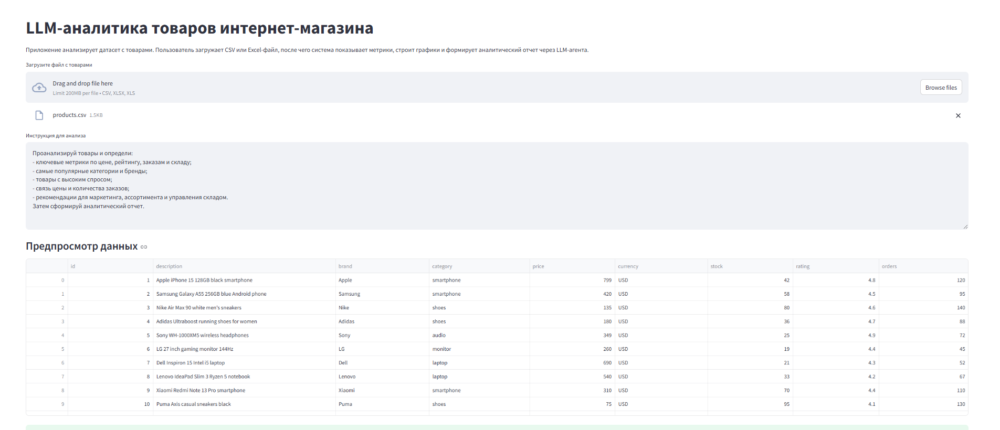
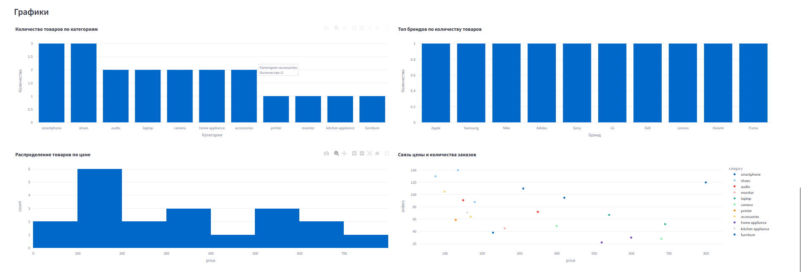
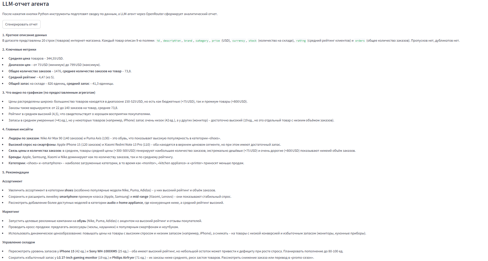

# Задание 3 — Мини-продукт с LLM-аналитикой

Веб-приложение на Streamlit для анализа датасета товаров с помощью LLM-агента.

Пользователь загружает CSV или Excel-файл, пишет инструкцию для анализа, после чего приложение:

- читает датасет;
- рассчитывает ключевые метрики;
- строит графики;
- вызывает LLM через OpenRouter API;
- возвращает аналитический отчет, инсайты и рекомендации.

## Запуск

Установить зависимости:

```bash
pip install -r requirements.txt
```

Создать файл `.env`:

```env
OPENROUTER_API_KEY=Ваш_ключ
MODEL=nvidia/nemotron-3-nano-omni-30b-a3b-reasoning:free
```

Запустить приложение:

```bash
streamlit run app.py
```

После запуска откроется веб-страница, куда можно загрузить CSV или Excel-файл.

## Входной файл

В проекте есть пример входного файла:

```text
products.csv
```

Ожидаемые столбцы:

```text
id, description, brand, category, price, rating, orders, stock
```

## Скриншот работы

1. Загрузка файла и предпросмотр данных  
   
2. Графики  
   
3. Сформированный отчет агентом  
   
